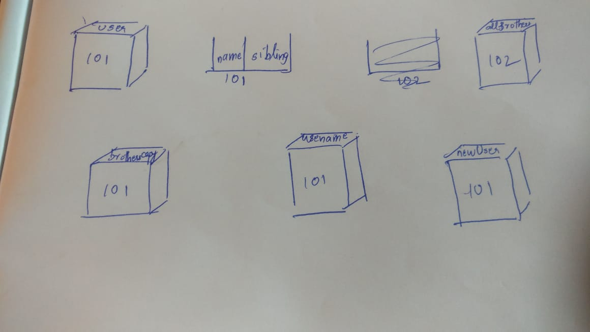

```js
let user = {
  name: 'Arya',
  sibling: ['Robb', 'Ryan', 'John'],
};
let allBrothers = ['Robb', 'Ryan', 'John'];
let brothersCopy = user.sibling;
let usename = user.name;
let newUser = user;
```

1. Memory representation

- Create the memory representation of the above snippet on notebook.
- Take a photo/screenshot and add it to the folder `code`

<!-- To add this image here use  -->


2. Answer the following with reason:

- `user == newUser;` // True same memory reference
- `user === newUser;` // True same memory reference
- `user.name === newUser.name;` // True same memory reference
- `user.name == newUser.name;` // True same memory reference
- `user.sibling == newUser.sibling;` // True same memory reference
- `user.sibling === newUser.sibling;` // True same memory reference
- `user.sibling == allBrothers;` // False different memory reference
- `user.sibling === allBrothers;` // False different memory reference
- `brothersCopy === allBrothers;` // False different memory reference
- `brothersCopy == allBrothers;` // False different memory reference
- `brothersCopy == user.sibling;` // True same memory reference
- `brothersCopy === user.sibling;` // True same memory reference
- `brothersCopy[0] === user.sibling[0];` // True same memory reference
- `brothersCopy[1] === user.sibling[1];` // True same memory reference
- `user.sibling[1] === newUser.sibling[1];` // True same memory reference
